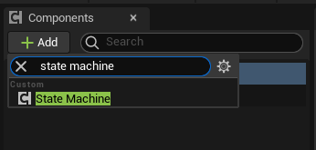
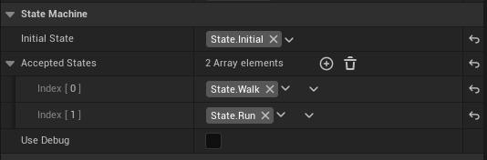
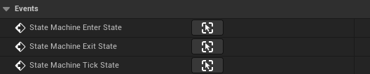
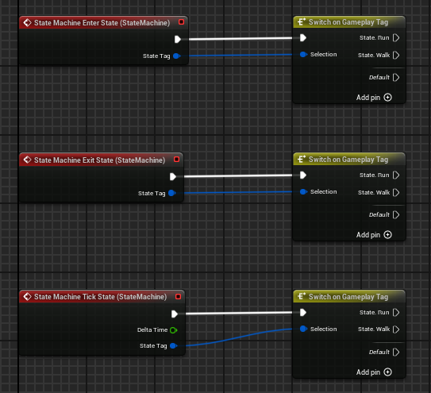
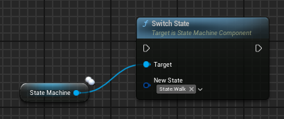

# UE5 Simple State Machine

This plugin is a simple implementation of a State Machine using Gameplay Tags as States.

The State Machine is a Actor Component, that way, it can be used on any Actor, no matter what it's used for. And it can be used with any GameplayTags.

## Installation

Just download the release, open it and drop the folder `State_Machine` into the `Plugins` folder of your project. If the `Plugins` folder doesn't exist in your project, then create it.

## How to use it (Blueprint)

1. Open the blueprint of the desired actor
2. Add the state machine component using the `Add Component` button



3. Configure the component by setting the `Initial State` and the `Accepted States`



4. (Optional) Enable the debug and set the key id
5. Implement the state machine delegates (You don't need to use all three of them, just the one that you need)





6. To change the state of the State Machine, use the `SwitchState` function from the State Machine Component



## How to use it (C++)

1. First, you need to add the plugin to your project dependency in the file `{ProjectName}.Build.cs`

```cpp
PrivateDependencyModuleNames.AddRange(new string[] { "GameplayTags" , "State_Machine" });
```

2. After that, you can add the component in the header file of your actor

```cpp
UPROPERTY(VisibleAnywhere, Category = "Actor Components")
UStateMachineComponent* StateMachineComponent;

```

3. And create also the function to bind to the delegate of the state machine

```cpp
UFUNCTION()
void OnEnterState(FGameplayTag State);
UFUNCTION()
void OnExitState(FGameplayTag State);
UFUNCTION()
void OnTickState(float DeltaTime, FGameplayTag State);
```

4. Then, create the component in the actor constructor

```cpp
// Sets default values
AMyActor::AMyActor()
{
 	// Set this actor to call Tick() every frame.  You can turn this off to improve performance if you don't need it.
	PrimaryActorTick.bCanEverTick = true;

	// Create the state machine component
	StateMachineComponent = CreateDefaultSubobject<UStateMachineComponent>(TEXT("State Machine"));
	StateMachineComponent->RegisterComponent();

	// Initialize the initial state and the accepted states of the state machine
	StateMachineComponent->InitialState = FGameplayTag::RequestGameplayTag(FName("State.Initial"));
	StateMachineComponent->AcceptedStates = {
		FGameplayTag::RequestGameplayTag(FName("State.Walk")),
		FGameplayTag::RequestGameplayTag(FName("State.Run")),
	};
}
```

5. Inside the BeginPlay function, bind the delegates to the State Machine

```cpp
// Bind the delegate to the state machine
void AMyActor::BeginPlay()
{
	Super::BeginPlay();

	// Bind the delegate to the state machine
	StateMachineComponent->StateMachine_EnterState.AddDynamic(this, &AMyActor::OnEnterState);
	StateMachineComponent->StateMachine_ExitState.AddDynamic(this, &AMyActor::OnExitState);
	StateMachineComponent->StateMachine_TickState.AddDynamic(this, &AMyActor::OnTickState);
}
```

6. Implements the delegates that you bind to the State Machine

```cpp
void AMyActor::OnEnterState(FGameplayTag State)
{
    // Check if the given state match the "State.Walk" or "State.Run"
	if(State.MatchesTagExact(FGameplayTag::RequestGameplayTag(FName("State.Walk"))))
	{

	} else if(State.MatchesTagExact(FGameplayTag::RequestGameplayTag(FName("State.Run"))))
	{

	}
}

void AMyActor::OnExitState(FGameplayTag State)
{
    // Check if the given state match the "State.Walk" or "State.Run"
	if(State.MatchesTagExact(FGameplayTag::RequestGameplayTag(FName("State.Walk"))))
	{

	} else if(State.MatchesTagExact(FGameplayTag::RequestGameplayTag(FName("State.Run"))))
	{

	}
}

void AMyActor::OnTickState(float DeltaTime, FGameplayTag State)
{
    // Check if the given state match the "State.Walk" or "State.Run"
	if(State.MatchesTagExact(FGameplayTag::RequestGameplayTag(FName("State.Walk"))))
	{

	} else if(State.MatchesTagExact(FGameplayTag::RequestGameplayTag(FName("State.Run"))))
	{

	}
}
```

7. To change the state of the State Machine, use the `SwitchState` function from the State Machine Component

```cpp
 StateMachineComponent->SwitchState(FGameplayTag::RequestGameplayTag(FName("State.Walk")));
```
